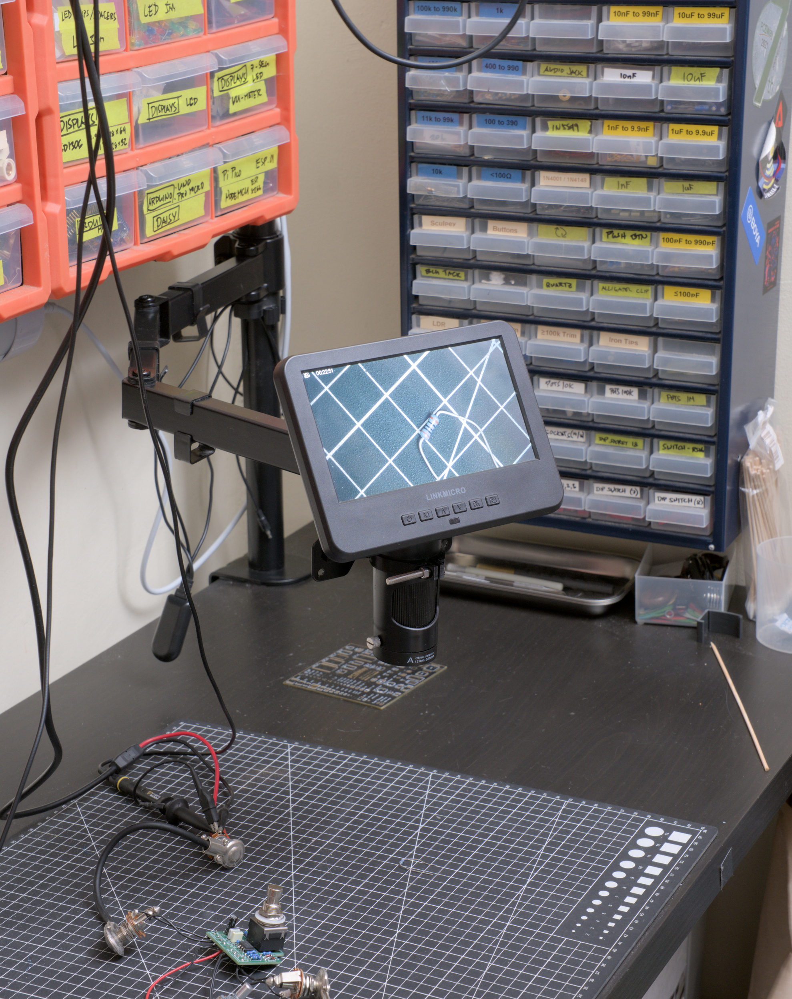
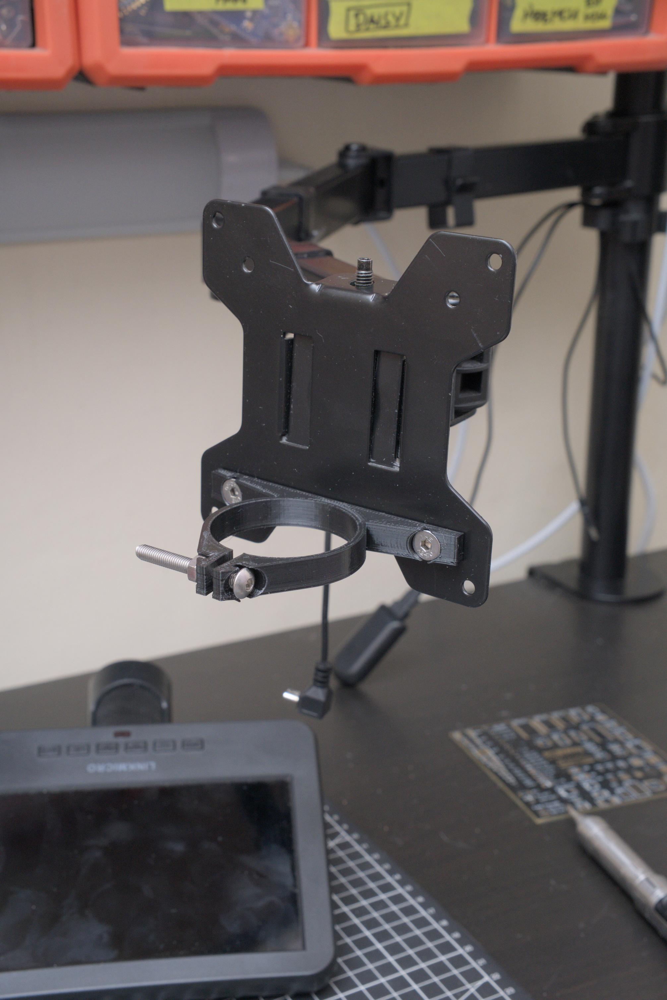

# MicroscopeVesaMount
A parametric mount for digital microscopes to VESA-compatible monitor arms. Tested using my Linkmicro LM246MS.

## LICENSE
This work is licensed under a
[Creative Commons Attribution 4.0 International License][cc-by].

[cc-by]: http://creativecommons.org/licenses/by/4.0/
[cc-by-shield]: https://img.shields.io/badge/License-CC%20BY%204.0-lightgrey.svg